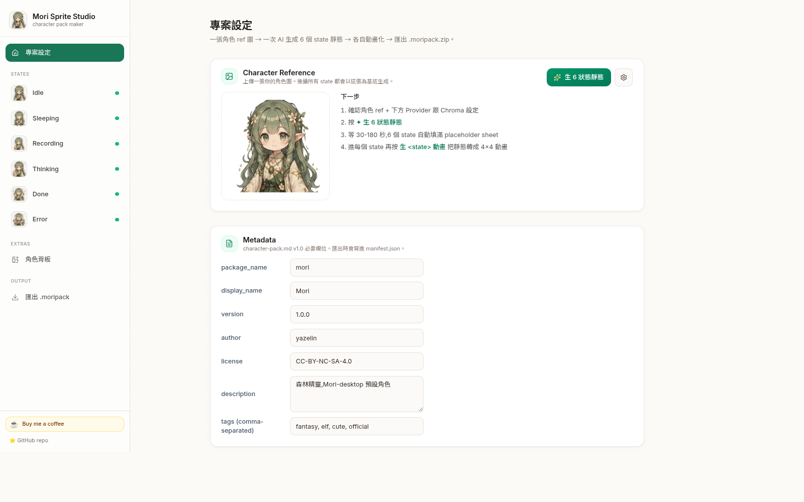
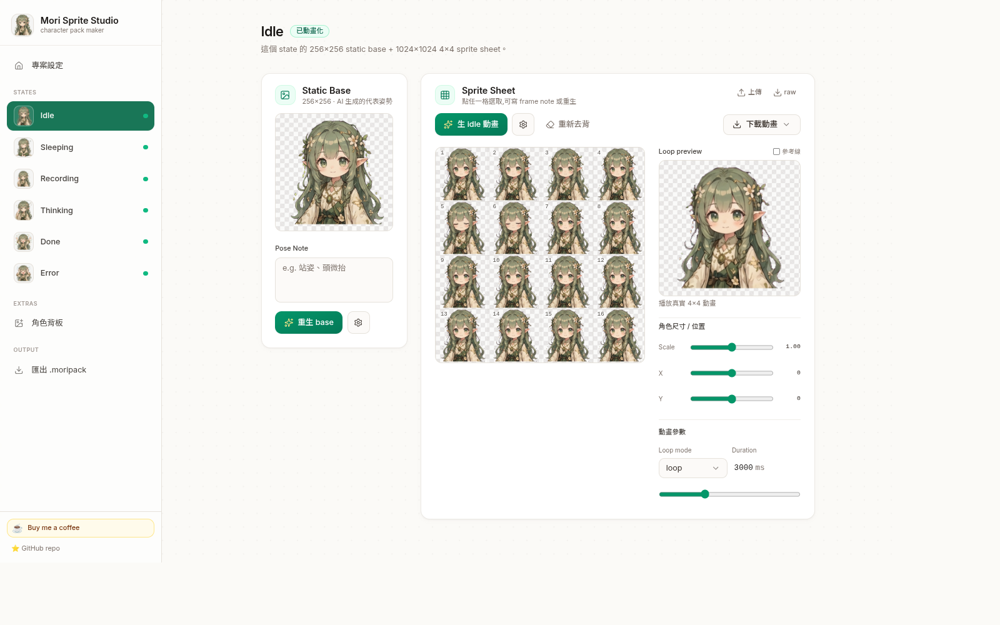
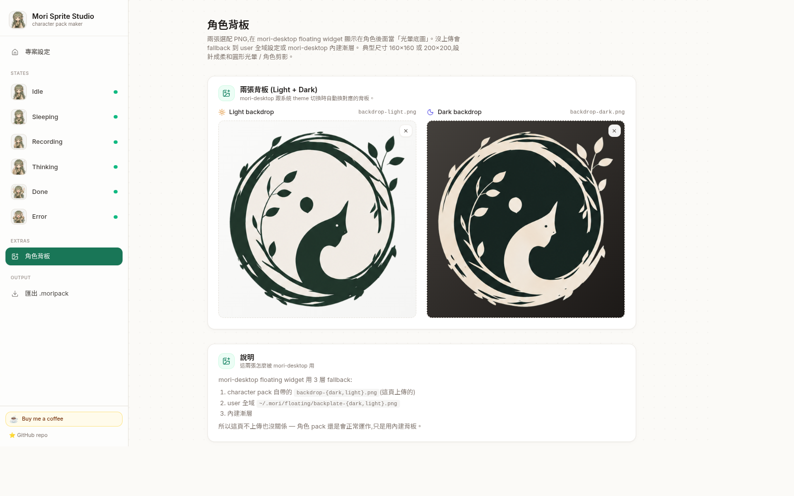
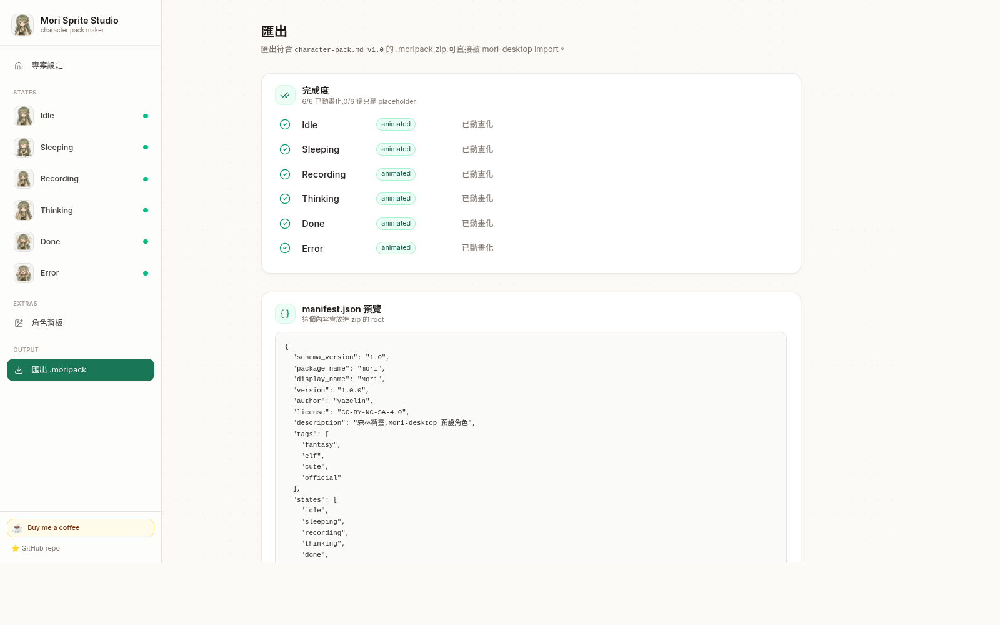

<div align="center">

# Mori Sprite Studio

🌐 [English](./README.md) · **繁體中文**

**從一張角色 ref 圖,一鍵生成 1024×1024 的 4×4 sprite 動畫包。**

AI 驅動。純瀏覽器。透明背景。多種匯出格式。

 &nbsp; 

[**▶ 試玩線上 app**](https://mori-sprite-studio.vercel.app) · [文件 / 截圖](https://yazelin.github.io/mori-sprite-studio/index.zh-TW.html) · [☕ 請我喝咖啡](https://buymeacoffee.com/yazelin)

</div>

---

## 這個工具做什麼

給它**一張你的角色 ref 圖**,它幫你生出完整給 [mori-desktop](https://github.com/yazelin/mori-desktop) 用的 sprite 動畫包 — **6 個必要 + 2 個可選 state**,每個都是 1024×1024 的 4×4 sprite sheet,mori-desktop 浮動視窗會播放。

| 必要(6) | 可選(2) |
|---|---|
| idle / sleeping / recording / thinking / done / error | walking / dragging |

這個專案是為 [**Mori**](https://github.com/yazelin/mori-desktop) 而生 — yazelin 的**森林精靈** Jarvis-style AI 夥伴,住在桌面上。_「Iron Man 有 Jarvis,我有 Mori。」_ 這個 studio 做的就是 Mori 的**可見身體** — 她的 sprite 形態,mori-desktop 浮動視窗會把她動畫化。

當然這工具也適合**任何你想給「可見身體」的角色**:你自己的 AI 夥伴 / 個人精靈 / 直播 overlay / 角色 mascot 都可以。Mori demo 只是一個範例。

也可以單獨把每個 state 匯出成 APNG / GIF / WebM / 原始 sheet PNG — 用在 LINE 動態貼圖、Discord、OBS overlay、影片剪輯等等。



---

## 工作流程

```
[角色 ref 圖]
       │
       │ (AI · 1 call → 6 格 grid)
       ▼
[6 個靜態 base pose]      ← 每個 state 可獨立重生
       │
       │ (AI · 6 calls,每 state 一次)
       ▼
[6 張 sprite sheet,4×4]   ← 每格可編輯、跨 state normalize
       │
       │ (可選) walking + dragging
       ▼
[+2 張循環運動 sheet]      ← W/Dr 獨立 pipeline(不 pre-tile)
       │
       │ (手動排序:反向 + 換位)
       ▼
[手調過的 gait cycle]
       │
       │ (bake transforms + zip)
       ▼
[mori.moripack.zip]        →    mori-desktop
       │
       │ (每 state 可選)
       ▼
[mori-{state}.png / .gif / .webm]    →    LINE / Discord / OBS
```

1. **上傳角色 ref** — 任何 PNG / JPG,任何背景都行。
2. **生 6 個靜態** — 一次 AI call 出 3×2 grid,自動切成 6 個 state pose。
3. **每 state 生動畫(必要 6 個)** — 用 pre-tile placeholder + 多 anchor identity ref,把角色位置鎖住,只加微擾(眨眼、呼吸、小手勢)。
4. **可選的 walking + dragging** — 走獨立 W/Dr pipeline(不 pre-tile,因為步行循環需要每格都不同 pose)。「反向順序」+「換位模式」buttons 讓你手動排序到走路看起來對為止。
5. **細調** — 每格獨立重生、loop 設定、跨 state normalize 尺寸、scale / offset sliders、原始 sheet 上傳 / 下載 Photoshop round-trip。
6. **角色背板**(可選)— 上傳 Light + Dark 兩張背板。用**桌面預覽**分頁看所有 state 疊在背板上的樣子,可切 shape / theme。
7. **匯出** `.moripack.zip` 給 mori-desktop,或每 state 單獨匯出 APNG / GIF / WebM 給其他平台。



---

## 功能

**生成**
- 4 個 AI provider:**Author Fallback**(免設定預設)、**Codex-Image**(用你 ChatGPT Plus/Pro 額度,透過 [yazelin/codex-image-service](https://github.com/yazelin/codex-image-service))、**Vertex Gemini**、**Google Gemini Direct**
- 防抖動:pre-tile placeholder sheet 當 AI ref,鎖住角色 16 格內位置不會飄
- 防角色 drift:多 anchor identity ref(其他 state 的 staticBase 都當 outfit anchor 一起送)
- 身體結構無關 prompt:人形 / 植物 / 機器人 / 史萊姆 / 寶石都能用 — semantic 描述抽象 motion
- One-shot 兩種 pattern:BURST-AND-SETTLE(歡呼)vs SUSTAINED-ENERGY(慌張)
- BYOG 路徑:複製 prompt + ref,自己跑 AI,回來上傳結果

**Walking + Dragging(可選的循環運動 state)**
- 專屬 **W / Dr 獨立 pipeline** — 不 pre-tile(那會把角色鎖在一個 pose)。AI 從 character ref + neutral 全身站姿自由設計 16 cells
- Template 內含明確 gait/swing cycle 結構(16-frame breakdown:cell 1 = 左腳前、cell 7 = 右腳前 等等)
- 強 identity lock:「character design / hair / clothes / art style 16 cells 都鎖住,**只**讓腿、手、 body tilt 變化」
- Walking sprite 設計面**右** — mori-desktop engine 用 `scaleX(-1)` 鏡像向左

**手動 cell 排序(生成後微調)**
- **↺ 反向順序** — 一鍵反向 16 cells(救「動畫看起來在後退」)
- **✥ 換位模式** — 開啟後點 cell A → 點 cell B → 兩格互換。保持 ON 可連續多次 swap。手動排到走路看起來對為止。

**桌面預覽分頁(模擬桌面)**
- 6+2 個 floating widget mockup 同時排出來,跟 mori-desktop 真實 render 1:1 對應:
  - 200×200 stage + 背板(`object-cover` 蓋滿)
  - 130×130 sprite 置中(`drop-shadow` 跟 floating.css 一致)
  - 1px outline(對應 XShape clip)
  - 真實 3 層 backdrop 合成(vignette + PNG + base gradient — 從 mori-desktop computed style 1:1 抄過來)
- 獨立切換:**mori-desktop App theme**(亮/暗 背板)× **OS theme**(亮/暗 桌布)× **shape**(圓/圓角/方)× **backplate mode**(顯示/關閉)
- 內含技術說明:為什麼有背板(Linux X11 + WebKit2GTK alpha-compositing bug workaround)、3-tier backplate fallback chain 怎麼運作

**編輯**
- 每格獨立重生,用 `prev frame + next frame + staticBase` 當 context 做平滑插值
- 可編輯每 state prompt template + 每格 note
- 每 state Pose Note
- 每 state loop mode(loop / one-shot)+ duration slider

**去背**
- 可選 chroma key(綠或洋紅)+ 三級 tolerance
- 邊緣 erosion(0-10 px)清掉殘留 chroma halo
- 「重新去背」從原始 raw AI 輸出重跑(非破壞性 — erosion 可上下調)

**跨 state 對齊**
- 一鍵 `Normalize` 掃描每 state 的角色 bbox,算出 per-state transform(scale + offset),讓 mori-desktop 切 state 時尺寸一致
- 每 state 微調 sliders:scale / offsetX / offsetY
- Loop preview 上有參考線疊圖對齊用

**匯出**
- `.moripack.zip` — mori-desktop 用的角色包(manifest + 6 必要 sheet + 0/1/2 可選 walking/dragging + 2 背板)
- 每 state:APNG(透明,LINE/Discord)、GIF(相容性最廣,1-bit alpha)、WebM(VP9 + alpha,OBS overlay)
- 原始 sheet 下載(1024×1024 PNG)外部編輯用
- `.moriproject.zip` 存讀檔 — 完整作者狀態(sheets + raw + 設定)之後可載回繼續編輯,或分享給人

**Demo loader**
- 專案頁有「✦ 載入 Mori 預設範本」按鈕,一鍵載入完整 27 MB Mori demo,確認對話框會提醒會覆蓋當前資料

**角色背板**
- 上傳 Light + Dark 兩張背板 PNG,一起打包進 `.moripack`,對應 [mori-desktop PR #107](https://github.com/yazelin/mori-desktop/pull/107) 的 3-tier backplate chain

**Quota counter + rate limit(Author Fallback)**
- Sidebar 底部即時倒數 `50 → 0` 顯示今日剩餘 Author-Fallback 呼叫(per IP)
- 用 Vercel KV(Upstash Redis)持久化 — Vercel function cold start 不會 reset counter
- KV env var 沒設時 graceful fallback in-memory
- 每 IP 同時 1 張(防多 tab 並行濫用)
- `GET /api/generate` 回傳當前 quota,不耗額度(sidebar polling + 生成後刷新用)



---

## 快速上手

### 用線上 app

1. 開 <https://mori-sprite-studio.vercel.app>
2. 專案頁點 `✦ 載入 Mori 預設範本`(一鍵載入完整 Mori 角色包 — 27 MB)
3. 到處逛逛看怎麼跑
4. 要做自己的:清資料(或開 incognito),上傳你的角色 ref,點 `生 6 狀態靜態` → 每 state `生動畫`

Author Fallback 用 yazelin 自己的 API key — 免設定。**我自掏腰包暫時開放給大家試用。** ⚠ 每 IP 上限 **50 次/day + 同時 1 張**,**用 Vercel KV 持久化**所以真的會扣(Vercel cold start 不會 reset)。Sidebar 底部有倒數 counter。**錢花完就會關掉** — 不是長期承諾,只是讓陌生人也能試一下。想讓它繼續開著,請 ☕ [補點咖啡錢](https://buymeacoffee.com/yazelin)。

### 自架

```bash
git clone https://github.com/yazelin/mori-sprite-studio
cd mori-sprite-studio
npm install
npm run dev              # Vite dev server
# 或
npm run dev:vercel       # vercel dev — 測 /api/generate Author Fallback proxy 用
```

本機跑 Author Fallback 在 `.env.local` 設:

```env
AUTHOR_FALLBACK_PROVIDER=vertex-gemini
AUTHOR_API_KEY=AQ.AAAA...    # Vertex AI Express key 開頭是 AQ
AUTHOR_MODEL=gemini-3-pro-image-preview
AUTHOR_IMAGE_SIZE=1K
# 可選 — 持久 rate limit
KV_REST_API_URL=...
KV_REST_API_TOKEN=...
```

部署到 Vercel:

```bash
vercel --prod
```

同樣的 env vars 在 Vercel Dashboard → Settings → Environment Variables 設一次 production。

要啟用 KV rate limit:`vercel install upstash-kv` → connect to project → redeploy。

---

## 架構

| Layer | Tech |
|---|---|
| UI | Vite + React 19 + TypeScript + Tailwind CSS + shadcn/ui |
| State | Zustand + IndexedDB(idb-keyval)Blob 原生持久化 |
| AI providers | 抽象 `ImageProvider` 介面 + 4 個實作 |
| 動畫 pipeline | C template(pre-tile,idle 類)+ W/Dr template(獨立,gait/swing 類)|
| Chroma key | 2-pass per-channel dominance + despill + 邊緣 erosion |
| Cell 操作 | Canvas 為基底的 reorder / swap / reverse(`imageOps.ts`)|
| 動畫預覽 | Canvas + requestAnimationFrame(16-frame row-major)|
| 匯出 encoder | upng-js(APNG)、gifenc(GIF)、MediaRecorder + VP9(WebM)、JSZip |
| Server-side | Vercel Function `/api/generate` — Author Fallback proxy + KV-backed rate limit(Upstash Redis,fallback in-memory)|

輸出規格:1024×1024 PNG-32,4×4 grid,每格 256×256,row-major frame order,透明背景。對應 mori-desktop 的 `character-pack.md` v1.0。

---

## 檔案格式

| 格式 | 用途 | 內容 |
|---|---|---|
| **`.moripack.zip`** | Consumer 格式 — 拖進 mori-desktop characters 資料夾 | manifest.json + sprites/{6+0~2 state}.png + backdrop-{light,dark}.png |
| **`.moriproject.zip`** | Author 格式 — 之後可載回繼續編輯 / 分享起始點 | project.json + character-ref.png + sprites/{state}/{sheet,raw-sheet,static-base,raw-static-base}.png + backdrops |
| **APNG**(.png) | 透明 + 循環。LINE 動態貼圖、Discord、Slack、Twitter inline | 標準 APNG with acTL/fcTL chunks |
| **GIF**(.gif) | 相容性最廣(Mac Preview、Windows Photos 都會動)。1-bit alpha 邊緣稍粗 | 標準 GIF89a |
| **WebM**(.webm) | VP9 + alpha channel。OBS 串流 overlay、QuickTime、瀏覽器。錄 3 個 loop | VP9 via MediaRecorder |
| 原始 sheet(.png) | 1024×1024 4×4 sheet 本身。外部編輯 / 檢查用 | PNG-32 RGBA |



---

## 每 state 細節(Mori 角色的預設值)

| State | 必要 | Loop mode | Duration | Pose hint |
|---|---|---|---|---|
| idle | ✓ | loop | 3000 ms | 站著正面,溫和微笑,平靜歡迎 |
| sleeping | ✓ | loop | 5000 ms | 盤腿,閉眼,雙手放腿上,飄一個 Z |
| recording | ✓ | loop | 1500 ms | 手 cup 在耳邊(**聽**你說話,不是拿 mic),眼睛睜大專注 |
| thinking | ✓ | loop | 2000 ms | 食指點額,眼睛上瞄,思考小星星 |
| done | ✓ | one-shot(sub-pattern A burst-and-settle) | 1800 ms | 雙手舉高歡呼,^v^ 大笑(超萌)|
| error | ✓ | one-shot(sub-pattern B sustained-energy) | 2000 ms | 雙手抱頭「oh no!」,小淚珠 / 緊張線(也超萌)|
| walking | opt | loop | 2500 ms | Neutral 全身站姿 ref(面右)。實際 gait cycle 在 16 frame 用 W template render。|
| dragging | opt | loop | 1600 ms | Neutral 全身 ref(靜態雙腳並立,動畫時懸吊擺盪用 Dr template)。|

必要 = mori-desktop 預期這 6 個。可選 = 沒提供時 mori-desktop fallback 用 idle.png + CSS transform。

State semantics 可在 project 內編輯 — 預設值看 `src/defaults/semantics.ts`。

---

## License

Studio code:MIT。

生出來的角色包(你做的 sprite):**你的作品,你選 license**。Mori reference 角色 bundle 當 demo 是 CC-BY-NC-SA-4.0(姓名標示,非商業,相同方式分享)。

---

## 支持

這個專案用愛跟咖啡跑著。如果你覺得實用:

<a href="https://buymeacoffee.com/yazelin"></a>

自掏腰包做的。咖啡錢直接拿去:
- Author Fallback 的 API quota(讓新人不會剛來就沒得抽)
- Vercel / domain 開銷
- Time + caffeine 繼續寫

也可以 ⭐ 這個 repo + 分享給任何要做自己 AI 夥伴 / 桌面精靈的人。

---

## 相關專案

- [mori-desktop](https://github.com/yazelin/mori-desktop) — 森林精靈 Mori 的桌面身體。yazelin 的 Jarvis-style AI 夥伴。Rust + Tauri 2 + Whisper(耳)+ LLM(腦)。這個 studio 做她的可見 sprite 形態。
- [world-tree](https://github.com/yazelin/world-tree) — Mori 的源頭 / 世界樹。Mori 來自的地方。
- [codex-image-service](https://github.com/yazelin/codex-image-service) — 自架 ChatGPT Plus/Pro quota 當 image-gen API(其中一個 provider)
- [line-sticker-studio](https://github.com/yazelin/line-sticker-studio) — 姐妹專案,LINE 貼圖製作(共用 prompt engineering pattern)
- [emoji-slot-machine](https://github.com/yazelin/emoji-slot-machine) — 姐妹專案,3×3 emoji 拉霸生成器(共用 sprite-sheet 動畫 pattern)

---

<div align="center">

由 [yazelin](https://github.com/yazelin) 帶著 🌿 做出來

</div>
